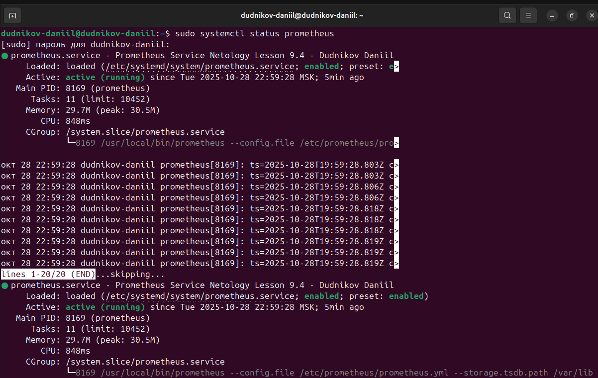
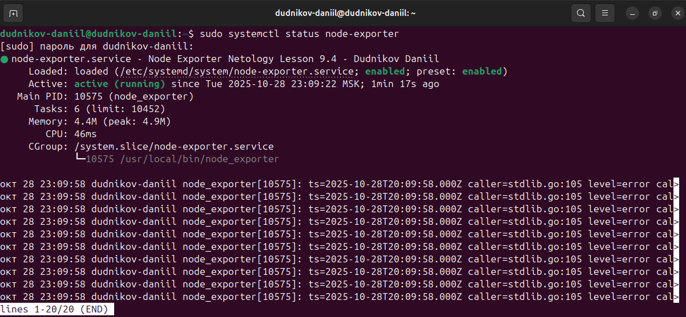
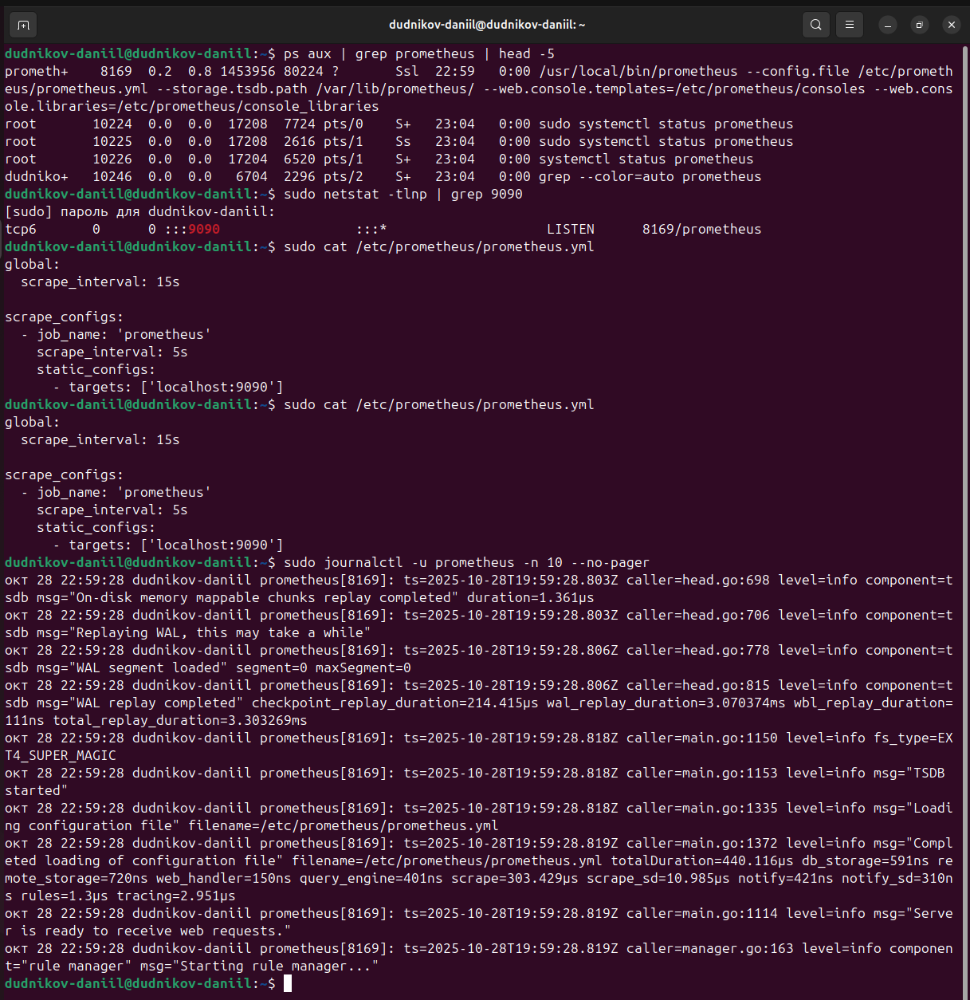
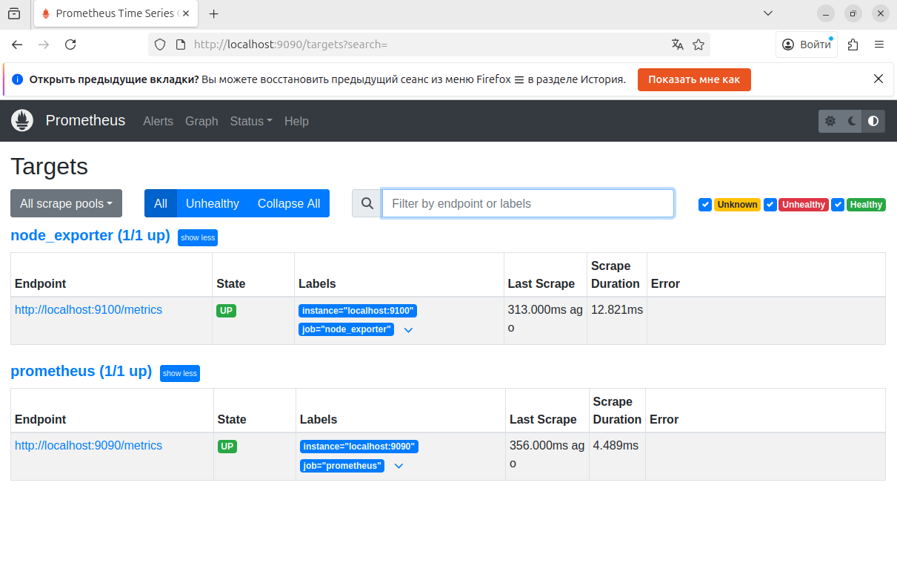
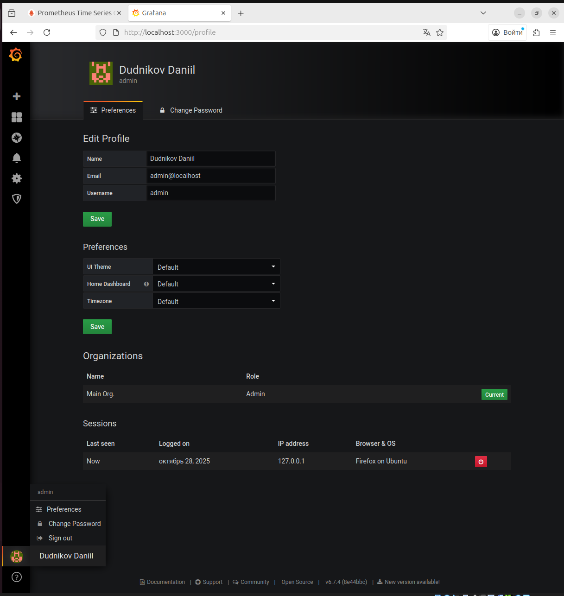
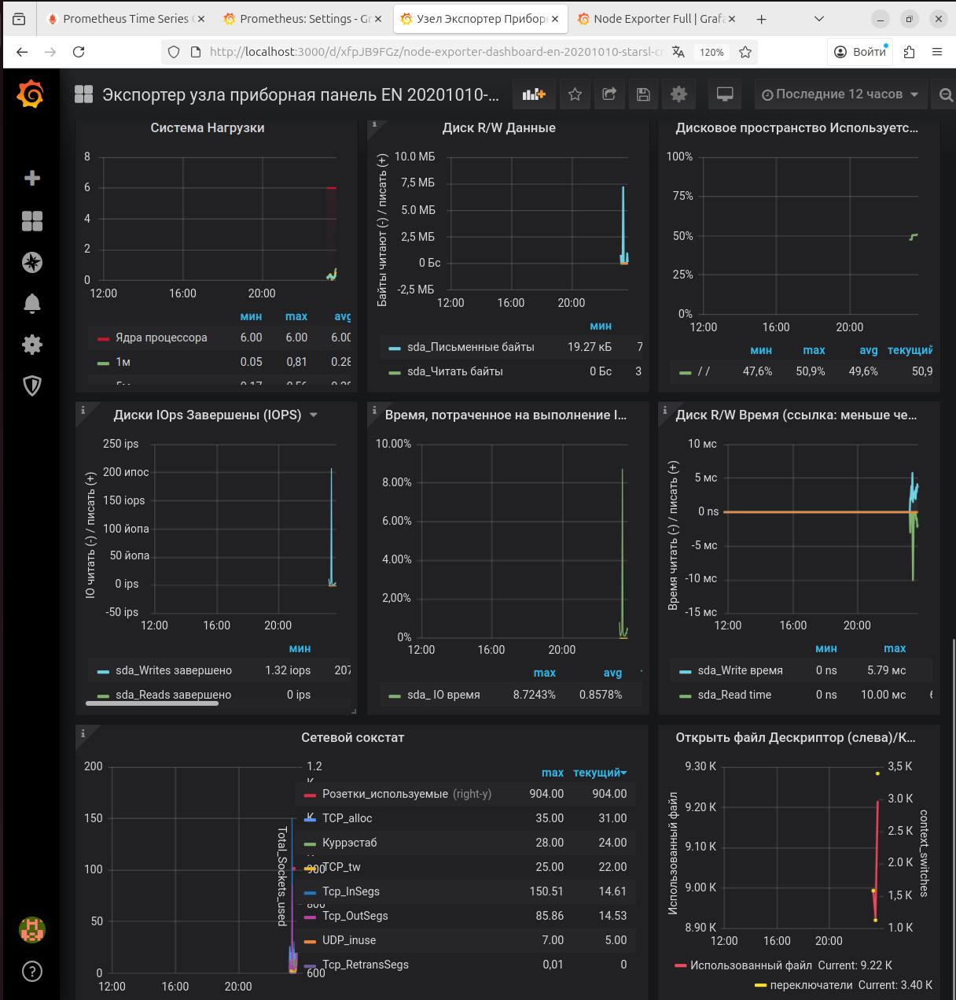
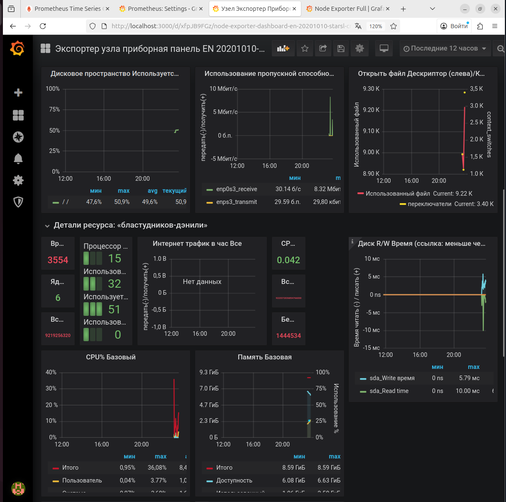

# Домашнее задание к занятию «Система мониторинга Prometheus»

**Студент:** Dudnikov Daniil  
**ОС:** Ubuntu 24.04.3

---

## Задание 1: Установка Prometheus

### Выполненные действия:
- Создан пользователь `prometheus`
- Установлен Prometheus 2.51.0
- Настроены системные директории
- Создан systemd сервис с описанием "Prometheus Service Netology Lesson 9.4 - Dudnikov Daniil"
- Проверена работа службы

### Результат:

---

## Задание 2: Установка Node Exporter

### Выполненные действия:
- Создан пользователь `node_exporter` 
- Установлен Node Exporter 1.8.1
- Создан systemd сервис с описанием "Node Exporter Netology Lesson 9.4 - Dudnikov Daniil"
- Проверена работа службы

### Результат:

---

## Задание 3: Подключение Node Exporter к Prometheus

### Выполненные действия:
- Обновлена конфигурация `prometheus.yml`
- Добавлен job для Node Exporter
- Перезапущен Prometheus
- Проверено подключение в веб-интерфейсе

### Результат:
**Конфигурация Prometheus:**

**Цели мониторинга (2 эндпоинта):**

---

## Задание 4*: Установка Grafana

### Выполненные действия:
- Установлен Grafana через snap
- Настроен профиль пользователя
- Указаны ФИО "Dudnikov Daniil" в профиле

### Результат:

---

## Задание 5*: Интеграция Grafana и Prometheus

### Выполненные действия:
- Добавлен источник данных Prometheus
- Импортирован дашборд Node Exporter
- Проверен сбор метрик

### Результат:
**Источник данных Prometheus:**

**Рабочий дашборд Node Exporter:**

---

## Общий вывод

**Все компоненты системы мониторинга успешно установлены и интегрированы:**
- **Prometheus** - сбор метрик
- **Node Exporter** - системные метрики  
- **Grafana** - визуализация данных
- **Все службы работают корректно**

